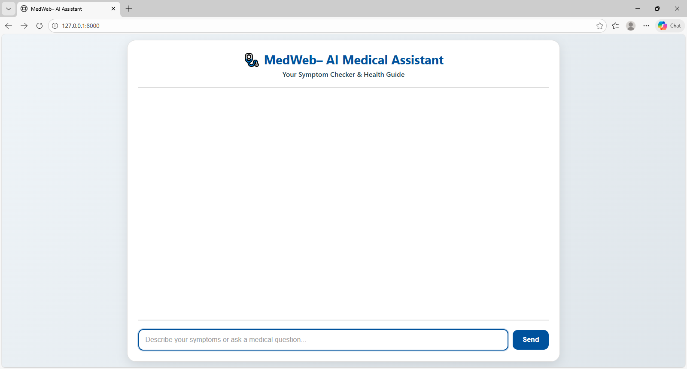
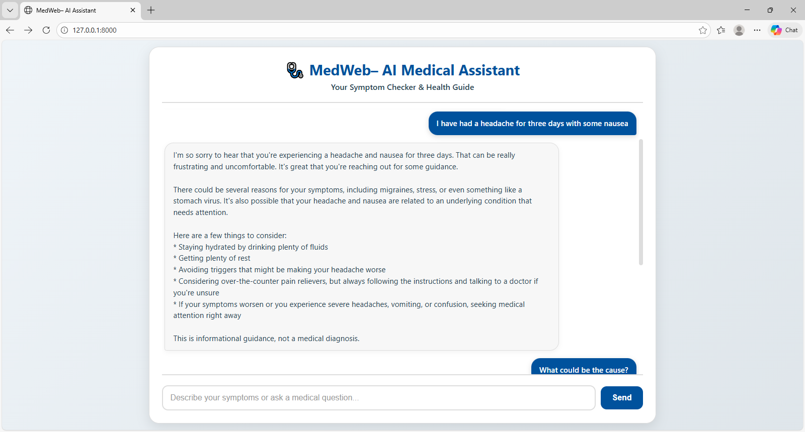

---

# MedWeb – AI-Powered Medical Chatbot

**MedWeb** is an intelligent AI-powered medical assistant. It uses **RAG (Retrieval-Augmented Generation)** to answer medical questions based on verified documents while providing human-like, warm, and empathetic conversation.

---

## Table of Contents

1. [Overview](#overview)
2. [Features](#features)
3. [Screenshots](#screenshots)
4. [Tech Stack](#tech-stack)
5. [Project Architecture](#project-architecture)
6. [Installation](#installation)
7. [Running](#running)
8. [Deployment](#deployment)
9. [Folder Structure](#folder-structure)
10. [Contributions](#contributions)
11. [License](#license)

---

## Overview

MedWeb is designed to:

* Provide reliable medical answers based on PDF documents.
* Understand symptoms described by users.
* Maintain natural, human-like conversation.
* Avoid hallucinations and ensure safe responses.

---

## Features

* ✅ Contextualized medical responses via RAG
* ✅ Casual conversational mode
* ✅ Information safety and reliability
* ✅ Support for PDF/medical documents as sources
* ✅ Interactive and responsive frontend

---

## Screenshots

> Create a folder in your repo: `assets/`
> Upload your screenshots there and update the filenames below accordingly.

### Chat Interface



### Medical Response (RAG)




### Medical Response (RAG)


---

## Tech Stack

| Component     | Technology / Library                |
| ------------- | ----------------------------------- |
| Frontend      | HTML, CSS, JavaScript               |
| Backend       | FastAPI, Python                     |
| Database      | FAISS (vector store)                |
| LLM           | Groq LLaMA 3.3–70B                  |
| Embeddings    | HuggingFace / Sentence Transformers |
| RAG Framework | LangChain                           |
| Deployment    | Docker, Render                      |

---

## Project Architecture

```text
AI_Medical_Chatbot/
│
├── app.py                  
├── store_index.py          
├── requirements.txt        
├── setup.py                
│
├── src/
│   ├── helper.py           
│   └── prompt.py           
│
├── static/
│   ├── style.css           
│   └── index.js            
│
├── templates/
│   └── index.html          
│
└── data/                   
│
└── faiss_index/
│
└── Dockerfile
```

---

## Installation

1. Clone the repository:

```bash
git clone https://github.com/IKRAM1919/AI_Medical_Chatbot.git
cd AI_Medical_Chatbot
```

2. Create a virtual environment:

```bash
python -m venv venv
source venv/bin/activate   # Linux / Mac
venv\Scripts\activate      # Windows
```

3. Install dependencies:

```bash
pip install --upgrade pip
pip install -r requirements.txt
```

4. Configure environment variables (example `.env`):

```env
GROQ_API_KEY=your_groq_api_key
HUGGINGFACE_ACCESS_TOKEN=your_huggingface_token
```

---

## Running

### Local

```bash
python app.py
```

Open browser at: `http://localhost:10000/`

### Docker

```bash
docker build 
docker run -p 8000:8000 
```

---

## Deployment

* Works on Render, Heroku, or any Docker + FastAPI hosting.
* Ensure environment variables for Groq and HuggingFace are set.

---

## Folder Structure

* `app.py` → FastAPI backend with RAG pipeline
* `store_index.py` → FAISS vector creation
* `src/helper.py` → PDF loading, chunking, embeddings
* `src/prompt.py` → RAG conversational prompt
* `static/` → Frontend styling and JS
* `templates/index.html` → Main UI
* `data/` → Medical PDFs

---

## Contributions

1. Fork the project
2. Create a branch: `git checkout -b feature/awesome-feature`
3. Commit: `git commit -m "Add new feature"`
4. Push: `git push origin feature/awesome-feature`
5. Open a Pull Request

---

## License

MIT License. See `LICENSE` file.

---

